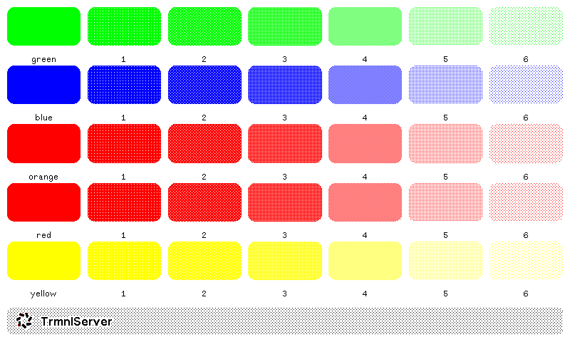

# Shades

An adoption of the [TRMNL Design Framework](https://usetrmnl.com/framework/background#usage) background shades, converted to color and optimized for eink displays.

This project converts grayscale background patterns from the trmnl framework into colored variants (red, green, blue, yellow, orange) suitable for eink displays.

## Description

The TRMNL Design Framework provides elegant grayscale background patterns. This project adapts those patterns by converting them into color variants that works well on color eink displays. Each color comes in multiple shades (1-6) plus a base color version.

## Preview



## Prerequisites

- **ImageMagick** (`magick` command) - Required for color conversion
  - Install on macOS: `brew install imagemagick`
  - Install on Linux: `sudo apt-get install imagemagick` (or equivalent)
- **curl**

## Usage

### 1. Download Source Images

Download the grayscale source images from the trmnl framework:

```bash
./download.sh
```

This will download `gray-1.png` through `gray-6.png` and `black.png` (if available) into the `input/` directory.

### 2. Convert to Colors

Convert the grayscale images to colored variants:

```bash
./convert.sh
```

This script will:
- Convert each gray image (`gray-1.png` through `gray-6.png`) to all color variants
- Convert `black.png` to base color versions
- Output files to `output/{color}/{color}-{shade}.png`

## Output Structure

After running both scripts, you'll have:

```
output/
├── red/
│   ├── red.png
│   ├── red-1.png
│   ├── red-2.png
│   └── ...
├── green/
│   ├── green.png
│   ├── green-1.png
│   └── ...
├── blue/
├── yellow/
└── orange/
```

## Colors

The following colors are generated:
- **Red** (`#FF0000`)
- **Green** (`#00FF00`)
- **Blue** (`#0000FF`)
- **Yellow** (`#FFFF00`)
- **Orange** (`#FFA500`)
